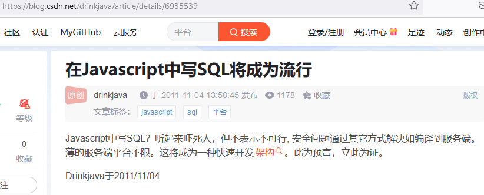

### MyServerless简介 | Description
MyServerless项目原名为GoSqlGo，表示可以直接在前端写SQL的意思，后来考虑到它的开发模式有点类似于serverless，后端不再参与开发，所以项目更名为MyServerless。  

MyServerless与通常大厂的Serverless服务相比，主要区别是：  
1.通常的Serverless是将代码放在云服务器上管理和运行，而MyServerless则是直接将SQL或Java源码写在前端，由前端负责保存和维护。  
2)云Serverless服务不区分开发期和布署期，而MyServerless因为安全原因，分为开发和布署两个阶段，开发期源码写在前端，布署期利用工具将前端的源码和SQL抽取到后端。  


### 使用
以下使用介绍基于实际示范项目ReactMRP展开，该项目主页位于这里：[ReactMRP](https://gitee.com/drinkjava2/reactmrp), 它把所有业务都写在前端，目前正在开发中，已完成登录和用户管理模块。   
基于MyServerless的项目分为后端和前端两部分，开发阶段要同时启动后端和前端服务。  

## 后端启动
运行ReactMRP的backend目录下的run-server.bat即可启动后端的MyServerless服务，服务启动后会自动打开浏览器访问 [http://localhost:8001](http://localhost:8001) 


## 前端启动
运行frontend目录下的:
npm install (仅第一次运行)
run_npm_start.bat  
启动完成后会自动打开浏览器访问 [http://localhost:3000](http://localhost:3000)  

## 打包和发布
1) 运行backend目录下的go-backend.bat，把SQL和Java抽取到后端，以实现安全性。  
2) 运行npm run build 生成发布包，并上传到生产服务器  

### 方法说明 | Methods
在前端引入myserverless.js这个javascript文件后，就可以直接在前端调用以下方法执行后端业务：  
```
$java(String, Object...) 在后端执行Java，第一个参数是Java源码，后续参数是业务参数，在Java源码里用$1,$2...来代表。  
$javaTx(String, Object...) 在后端执行Java并开启事务，如果有异常发生，事务自动回滚。  
$qryString(String, Object...) 将SQL查询结果的第一行第一列值转为字符串返回，第一个参数是SQL，后面是SQL参数，下同  
$qryObject(String, Object...) 将SQL查询结果的第一行第一列值对象返回，第一个参数是SQL，后面是SQL参数，下同  
$qryArray(String, Object...)  返回SQL查询的第一行数据，以Javascript数组对象格式返回  
$qryArrayList(String, Object...)  返回多行查询结果，以数组列表格式返回    
$qryTitleArrayList(String, Object...)  返回多行查询结果，以数组列表格式返回,第一行内容是各个列的标题  
$qryMap(String, Object...) 返回SQL查询的第一行数据，为Map 格式  
$qryMapList(String, Object...)  返回SQL查询的多行数据，为List<Map>格式  
$qryEntity(String, Object...)  返回第一行数据为实体对象，SQL写法是实体类名+逗号+SQL, 示例:$qryEntity(`#admin a.b.Demo, select * from demo`); 
$qryEntityList(String, Object...)  返回多行数据为List<实体>对象，SQL写法是实体类名+逗号+SQL, 示例:$qryEntityList(`#public a.b.Demo, select * from demo`);   
$executeSql(String, Object...) 执行一个SQL，返回SQL影响行数  
```
注意事项:
1.以上方法Java源码或SQL文本，要使用键盘ESC下方的单引号，这是Javascript的特殊引号，支持多行文本。  
2.以上方法并不是MyServerless自带的，而是项目自定义的，用户对每个项目可以自定义和登记自己的方法，具体细节请参见项目src/main/resources/template下的方法模板和InitConfig类。  
3.每个方法都要起一个方法ID，方法ID名允许重复，方法ID的作用是为了权限配置。例如下面这个方法定义了一个名为ReadUserAmount的方法ID  
``` 
 $java('#ReadUserAmount 
    import abc.DemoUser; 
    return new DemoUser().loadById($1).getAmount();
 ', 123); 
```
4.方法默认是异步的，返回值是一个json对象，如 {code:200, data:"123", msg:""}
5.每个方法可在前面加前缀改变它的返回值, 每个方法有4种变体：
  ```
          $java(`#xxxx return 123;`);  // 异步方法，返回 {code:200, data:123, msg:""}，返回后要在promise的then方法里接收值
      data$java(`#xxxx return 123;`);  // 异步方法，返回 json的data字段，即123这个值， 返回后要在promise的then方法里接收值
      sync$java(`#xxxx return 123;`);  // 同步阻塞方法，返回 {code:200, data:123, msg:""}
  syncData$java(`#xxxx return 123;`);  // 同步阻塞方法，返回 json的data字段，即123这个值
  ```

下面以一个实例来解说如果在前端使用MyServerless方法：
```
import * as my from "@/myserverless/myserverless.js"

export function tableList(query) { 
   return my.data$java(`#public
            Map m=(Map) $1;
            Object[] sql=new Object[]{" from sample where 1=1 ",
                    noBlank(" and title like ?","%",m.get("title"),"%"),
                    notBlank(" and star=?",  m.get("star")),
                    notBlank(" and status=?", m.get("status"))
                    };
            List items=DB.qryMapList("select * ",sql,  pagin((int)m.get("pageNumber"), (int)m.get("pageSize")));
            int total=DB.qryIntValue("select count(*) ",sql);
            m.clear();
            m.put("items", items);
            m.put("total", total);
            return m;
      `, query);
}
```
1.首先在js/ts/jsx文件里引入myserverless.js  
2.这个方法传入了一个参询对象query, 在java方法里$1代表这第一个参数，这段代码逻辑是根据参数动态分页查询，返回列表和符合条件的总记录数
3.my.data$java()说明返回的是一个值,即方法中的m变量，而且这是一个异步方法，所以要用promise形式来调用：
```
      ...... 
      tableList(query).then((map) => {
        if(map){ 
            const list = map.items;
            const total = map.total;
            if (this._isMounted) {
                this.setState({ list, total });
            }
        } 
```
  
### 配置
在类根目录(项目的resources目录)下，有一个名为myserverless.properties的配置文件，可以进行配置，例如配置deploy目录、设定开发/生产阶段、打包时是否生成API文档等，详见它的注释。  

# 安全
安全是重头戏，放在最后讲：  
1. 开发期用具有developer权限的账户登录，可在前端任意写SQL和Java，并发送到后端动态编译执行。项目需要写一个实现了TokenSecurity接口的类，在这个类里针对token、方法ID、用户权限来判断是否可以执行，具体参见ProjectTokenSecurity示例。  
2. 开发期对于每一个方法，由前端赋一个方法ID，比如 my.$executeSql(`#ReadUser drop table tb_user if exists`); 这个ReadUser方法ID说明登录用户必须服务端配置有ReadUser权限才能运行，用这种方式可以精确控制每个方法的执行权限。无须登录的公开方法必须起名为public前缀。如方法ID省略，系统默认起名为default。  
3. 发布前进行命名检查，防止方法ID要求的权限与它的代码内容不符，比如上面这个ReadUser方法ID，它的代码是在删库，和命名不符，所以要修改代码或者修改方法ID名。  
4. 发布前，用MyServerless提供的打包工具将前端SQL和java代码抽取到后端，这样线上运行时前端是看不到SQL和Java源码的，而且线上运行配置成拒绝动态编译执行。  
5. 方法也可以采用传统前后分离模式直接写在后端，参见项目中PublicBackend$TokenLogin示例，签权依然是统一按方法ID来判断。  

关于MyServerless的安全设计，大家可以启动ReactMRP用developer和admin、guest账号登录体验一下就知道了，除了developer账号，其余账号都无权动态执行前端的SQL和Java。另外欢迎大家来找出MyServerless项目的安全漏洞，虽然理论上是不存在的。   

MyServerless该说的重点都说完了，所以这篇介绍本身就是它的全部用户手册了，如果还有不清楚的，可以把ReactMRP实际跑一下，把后端部分研究一下就可以了。  

# 缘起 
对了，最后上一张图来说一下我为什么开发这个项目，我承经有过2个预言，第一个是2017年人类将被机器人代替，很遗憾这个预言失败了。第二个预言就是下面这张图，虽然作为一个预言家，自己实现自己的预言脸皮太厚了，但好在看来这第二个预言不会再失败了，因为道理很简单，我没有给它加上时间限制，哈哈。。。。。。
  


## 相关开源项目 | Related Projects
- [ORM数据库工具 jSqlBox](https://gitee.com/drinkjava2/jSqlBox)  

## 期望 | Futures
如对MyServerless感兴趣请点个赞  

## 版权 | License
[Apache 2.0](http://www.apache.org/licenses/LICENSE-2.0)

## 关注我 | About Me
[Github](https://github.com/drinkjava2)  
[码云](https://gitee.com/drinkjava2)  
微信:yong99819981(加群请留言"drinkjava2开源技术群")  
